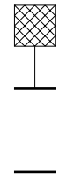
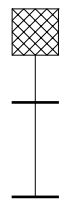
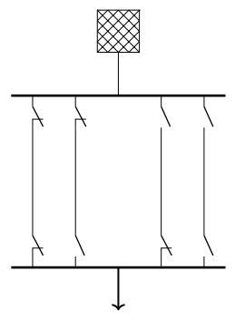
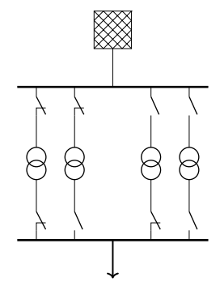
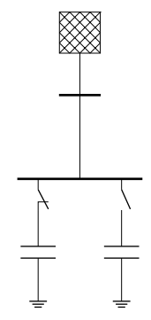
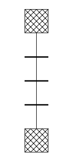
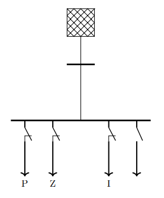
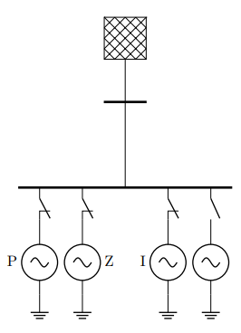
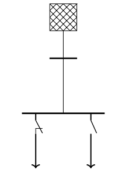
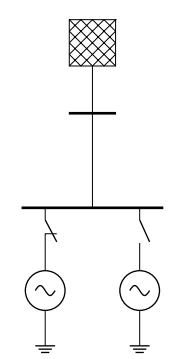

<!--
SPDX-FileCopyrightText: 2022 Contributors to the Power Grid Model project <dynamic.grid.calculation@alliander.com>

SPDX-License-Identifier: MPL-2.0
-->

# Model validation

power-grid-model is validated using multiple cases present in [\tests\data](..\..\tests\data) folder.
There are 2 simple grid test case examples of power-grid-model validated vision and gaia. 
A thorough validation is done using minimal test cases of each component and 2 test networks described in the following sections.

## Minimal test cases in pandapower

Their results are validated against the [pandapower](http://www.pandapower.org/) library.

The cases of a differences in modelling between both the libraries are handled by theoretical workarounds.
For example in power-grid-model, source impedance is included for all component sequences. 
In pandapower, source impedance is present only in positive sequence network whereas it considered in all sequence components in power-grid-model.
Source impedance is then set to a low value to match this modelling difference. 
Hence, the result of source component here should be ignored
All the test cases can be found in [\tests\data\power_flow\pandapower](..\..\tests\data\power_flow\pandapower)

### Node 

A node can have 2 states: energized and non-energized which is presented in the first grid.
The second grid example uses a line to validate node operation for voltages other than 0 or 1 p.u.
The circuit diagram for test cases of the 2 grids is as follows:




```{eval-rst}
.. tikz:: Node case
    :align: left
    \ (3,0) node[gridnode, anchor=south]{} to (3,-1);
    \draw [black, ultra thick] (2.5,-1) -- (3.5,-1);
    \draw [black, ultra thick] (2.5,-3) -- (3.5,-3);
```

```{eval-rst}
.. tikz:: Node case
    :align: left
    \draw (3,0) node[gridnode, anchor=south]{} to (3,-3);
    \draw [black, ultra thick] (2.5,-1) -- (3.5,-1);
    \draw [black, ultra thick] (2.5,-3) -- (3.5,-3);
```


### Line

A line can be 4 states, closed on both ends, open on both ends and open on any one end.
The circuit diagram for the test case is as follows:


### Transformer

A transformer can be 4 states, closed on both ends, open on both ends and open on any one end.
The tap changing functionality is tested using a batch calculation for various tap positions.

```{note}
- Asymmetrical calculations are possible only for grounded network transformer in pandapower. 
Hence open cases are not evaluated.
- Relaxed tolerance parameters are used in asymmetric calculation 
because only 'T' transformer model is available in pandapower while power-grid-model uses 'pi' model.
```


### Shunt

A shunt can be in 2 states: open or closed.


### Source

While source is present in all cases, this case tests two sources being used together.


### Symmetrical Load

A symmetrical load can be in open or closed state. It can be of 3 types: constant power, constant impedance and constant current.



### Symmetrical generator

A symmetrical generator can be in open or closed state. It can be of 3 types: constant power, constant impedance and constant current.


```{note}
Only constant power implementation is possible in pandapower for asymmetrical calculations. 
All the Z, I and P loads are already validated for symmetrical calculation.
```

### Asymmetrical load

An asymmetrical load can be in open or closed state. 


### Component Test Case: Asymmetrical generator

An asymmetrical generator can be in open or closed state.


## Test case creation

Contribution to power-grid-model is also possible by creating own test cases in similar format. 
A guide for exporting the input or output data is given in [Make Test Dataset](..\examples\Make%20Test%20Dataset.ipynb).